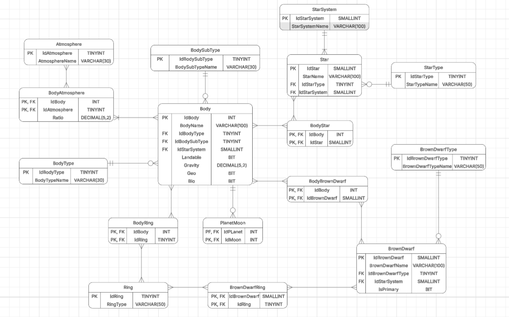

# StarSystemsDatabase

## Overview

In this repository, i keep track of the creation, since data modeling, development and administration of a database, personally developed, about star systems. Sharing all my knowledge and learning about **database administration, T-SQL, SQL Server** and much more!

## Goal

With this project i expect to show my hard skills in data manipulation and database administration in order to serve as a great evaluation to anyone interested in my knowledge. 
Being part of my portfolio to enter the database carrers path.

## Data Stored

The purpose of this database is to store various information about fictional star systems, from the composition of a celestial body's ring to the types of stars present in each system.

## Data Source

The data used in this project is obtained through various external APIs from the same website that exposes information generated by an astronomical simulator. The goal of this project is not to reproduce astronomy in the most realistic way possible 
The API is used exclusively as a data source, and the database was designed to be independent of the API, applying its own integrity and validation rules. 
[Here](https://www.edsm.net/) is the site containg every API.

## Main tables

- Body
- StarSystem
- Star
- Atmosphere 

See [Data Dictionary](/docs/data-dictionary.md) and [Tables Explanation](docs/modeling/tables-explanation.md) for all table's detail.

## Business Rules

This database has database level business rules ensured by triggers, checks and composite primary keys. 
See [Business Rules](/docs/business-rules.md) for a complete list and technical details.

## How to run

1. [Create Database](/schema/01_create_database.sql)
2. [Create Tables](/schema/02_create_table.sql)
3. [Create Triggers](/schema/03_create_trigger.sql)

